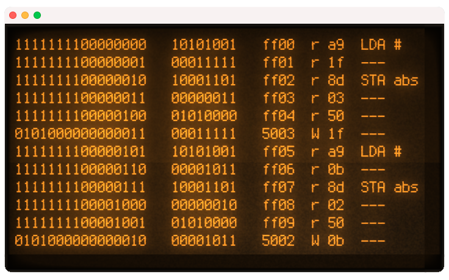

# 6502-monitor-plus

Extended version of [Ben Eater](https://eater.net)'s [Arduino 6502 monitor](https://eater.net/downloads/6502-monitor.ino) sketch, adding 65C02 OpCode decoding

&nbsp;[![CC BY 4.0][cc-by-shield]][cc-by]

The output above is the first few clock steps (after the 6502's seven-cycle reset sequence) of output from using 6502-monitor-plus with a BE6502 running WozMon.

## Attribution

This work, "6502-monitor_plus" is an extension to ["6502-monitor.ino"](https://eater.net/downloads/6502-monitor.ino), by [Ben Eater](https://eater.net), used under CC BY 4.0.  "6502-monitor_plus" is, similarly, licensed under CC BY 4.0 by Ian Dunmore.

## License
This work is licensed under a [Creative Commons Attribution 4.0 International License][cc-by].

[![CC BY 4.0][cc-by-image]][cc-by]

[cc-by]: https://creativecommons.org/licenses/by/4.0/
[cc-by-image]: https://licensebuttons.net/l/by/4.0/88x31.png
[cc-by-shield]: https://img.shields.io/badge/License-CC%20BY%204.0-orange.svg
