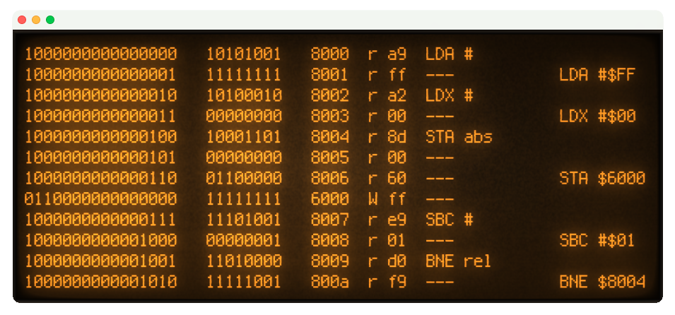

# 6502-monitor-plus

[](https://store-usa.arduino.cc/products/arduino-mega-2560-rev3/)&nbsp;[![CC BY 4.0][cc-by-shield]][cc-by]

"Extended" version of [Ben Eater](https://eater.net)'s [Arduino 6502 monitor](https://eater.net/downloads/6502-monitor.ino) sketch, adding 65C02 OpCode decoding, including full 6502 *assembly-style* output of decoded multi-byte instructions, and CPU status register/flags modelling/display.



The output above is the first few clock steps (after the 6502's seven-cycle reset sequence) of output from a simple assembly language program:

````
	.org $8000

init:
	sec	

reset:
	lda #$ff
	ldx #$00

loop:
	sta $6000
	sbc #$01
	bne loop

	jmp ($fff8)

	.org $fff8
	.word reset
	.org $fffa
	.word
	.word init
	.word
````

## Status Register/CPU Flag Output

### Flag States
The current state of each of the CPU flags is output, left to right as:

- [**N**]egative
- [**O**]verflow
- (always pushed as 1, always shown as -)
- "B" flag (virtual; usually -)
- [**D**]ecimal
- [**I**]nterrupt Disable
- [**Z**]ero
- [**C**]arry

An uppercase character indicates that flag is SET; lowercase is CLEAR.

A "?" in any flag's position means the state of that flag is not **known**; display would be speculative/misleading/wrong.

An "!"" annotating the overall flags display means the modeling of the instruction/flag behaviors is incorrect in some way.

### Relation to Instructions
The state of the flags is shown as they are BEFORE the instruction they **precede** is executed (in other words, their state **after** the last instruction was executed/retired); this is a deliberate choice as it allows you to see what the subsequent instruction SHOULD do:

````
1000000000001011   11111001   800b  r f9  ---           Nv--dIzC  BNE $8005
````

Here you can see the [**Z**]ero flag is CLEAR (lowercase "z"), so the branch is taken and execution will continue from $8005.

### State (De-)Sychronization

Observing and maintaining both initial, and on-going, *accurate* flag state is 100% dependent on the monitor seeing the whole address and data bus state, atomically, for **every** executional cycle.  Being tied to serial-output limits how fast this can run, and even without that overhead there are limits.  Thus, the higher the clock-speed, the greater the likelihood that a cycle will be missed, or will be skewed (address resolved, then changes before the data bus/SYNC pin is read).  When that happens, status register tracking will be de-synchronized and it can take a number of fully resolved, observed, cycles to re-sync.

The intended use of this monitor is for lower-clock rate execution and single-stepping, so you can follow what the CPU is doing.  The standard "clock module" is more than capable of cycling faster than this monitor can handle.  If you get nonsense (non-changing flag-status is a good indication), lower the clock speed.


## Theory of Operation

The basics are the same as the original; the devil is in the details.

An interrupt service routine, `onClock()` samples (captures) the address bus, the data lines, and both the read/write and SYNC lines.  That routine then dispatches address decoding, opcode detection (SYNC == HIGH), instruction decoding (getting the full opcode and addressing mode, resolving the addresses/registers, etc.) and formatting and, the hard part, determining the state of the CPU's status register/flags.

Why is it "hard" to determine the state of the CPU's status register?

It is **not directly accessible**; there is, understandably, no bit/pin-level output for those flags on the CPU itself.

This leaves two possibilities for getting those flags:

- Emulation
- Modeling (w/ some computation)

Emulation would be 100% deterministic, but since the point of this monitor is to see what the actual 65C02 hardware is **doing**, that's not an option.  And if it was, it'd need a full copy of the executing program, and any relevant ROM routines, as well as a full memory model, cycle computation and state model to work at all.

Modeling is, in theory, less involved.  It isn't trivial, and it isn't as accurate.  It is hampered by not being able to know the starting state of the CPU's status register and has to use a combination of deterministic and inferred/computed instruction behaviors to first get to a "known" flag-state, and then to properly mutate it as instructions are executed (retired).

Most executed instructions have specific, knowable, effects on various status flags that can be "observed".  CLC/SEC are obvious examples; directly affecting the [C]arry flag.  Others allow us to "infer" (it is actually deterministic) the status of other flags; BNE/BEQ expose the state of the [Z]ero flag based on whether the branch is taken or not.  PHP/PLP/BRK/RTI will actually expose the (six real) status flags on the bus.

ADC/SBC are the trickiest; they have to be *computed* as their results/effects never appear directly on the bus.

Where I can't be sure of status, either because the necessary factors have not yet been observed in the running code (e.g., at initialization/reset), flags will show as "?" rather than a "suspected" or "phantom" value.  This means that it can take several instructions before the status flag outputs become "reliable".  You can see this in the above sample image/code, as the C, N an Z flags resolve over several instructions.

*I've heavily commented (perhaps more "narrated") the actual code.  There is much more detail there, if you're interested in that sort of thing.*

## "Extensions"

Yes, "extensions" is in inverted-commas for a reason ...

The first version of this was a simple decoding, and output, of opcodes when the 65C02's SYNC line was HIGH.  That was a true, simple, "extension", adding an opcode look-up array and a modified serial output routine.  The "clever stuff" was still in Ben's original code.

The second version (tag "v1.0"), added full, "disassembly" style, decoding of instructions/execution, including address resolution for branches, JMPs and JSRs.  That was a bit more complicated, and a bit fiddly to get right, but still just an "extension".

Ahead of *this* version, I refactored how opcodes/instructions were represented (tag "v1.1"), since the *next* version was going to be more involved and needed to do, and understand, more about each opcode/instruction.

As it happens, this *next* version is a **lot** more involved ... and I wound up further refactoring (or, at least, splitting up) the instruction set structures.

This, third, version is less of an "extension", though it still contains some of the original code (the core output sampling/output loop, in the `onClock()` interrupt handler, isn't *radically* different), and more a different piece of software.  Big, and complex, enough that it really necessitated splitting it up, into multiple files, something that is a bit of a pain with the Arduino IDE/model.

This might be the biggest Arduino "program" (I hesitate to call it a "sketch" at this point), I've ever written.

## Attribution

This work, "6502-monitor_plus" is an extension to ["6502-monitor.ino"](https://eater.net/downloads/6502-monitor.ino), by [Ben Eater](https://eater.net), used under CC BY 4.0.  "6502-monitor_plus" is, similarly, licensed under CC BY 4.0 by Ian Dunmore.

## License
This work is licensed under a [Creative Commons Attribution 4.0 International License][cc-by].

[![CC BY 4.0][cc-by-image]][cc-by]

[cc-by]: https://creativecommons.org/licenses/by/4.0/
[cc-by-image]: https://licensebuttons.net/l/by/4.0/88x31.png
[cc-by-shield]: https://img.shields.io/badge/License-CC%20BY%204.0-orange.svg
